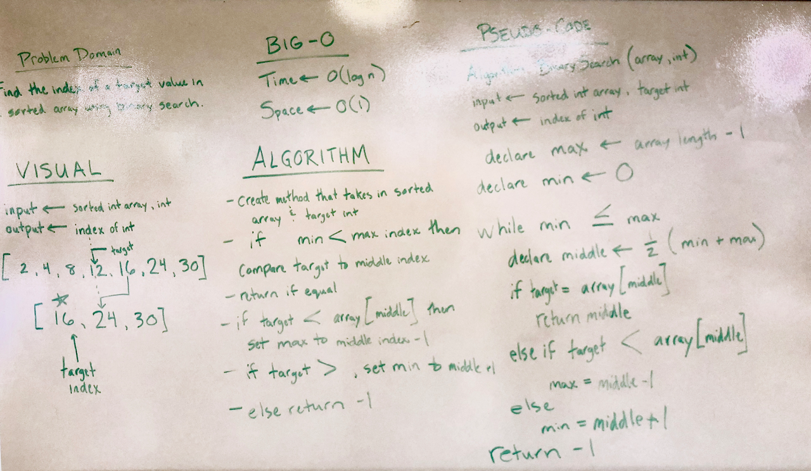

# Binary Search

# Challenge
Write a method takes a sorted array and a target integer as parameters. Without using built-in functions, return the index in the array of the target value using a binary search. Return -1 if the target does not exist in the array. 

# Solution

