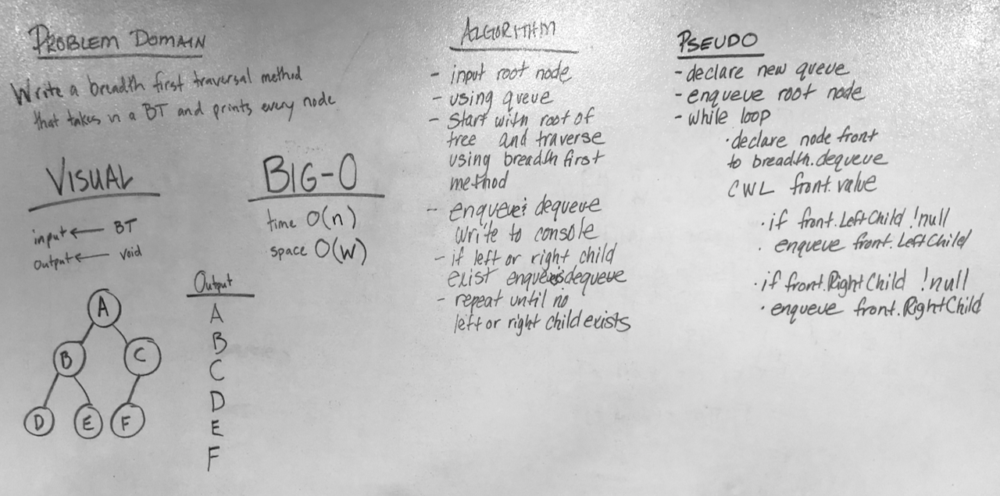

### Breadth First Traversal

## Challenge
 Write a breadth first traversal method which takes a Binary Tree as its unique input. Without utilizing any of the built-in methods available to your language, traverse the input tree using a Breadth-first approach; print every visited node’s value.  

## Approach & Efficiency
Time O(n) - the method must traverse each node in the binary tree  
Space O(W) - the queue is dependent on the width of the tree  

## Solution

