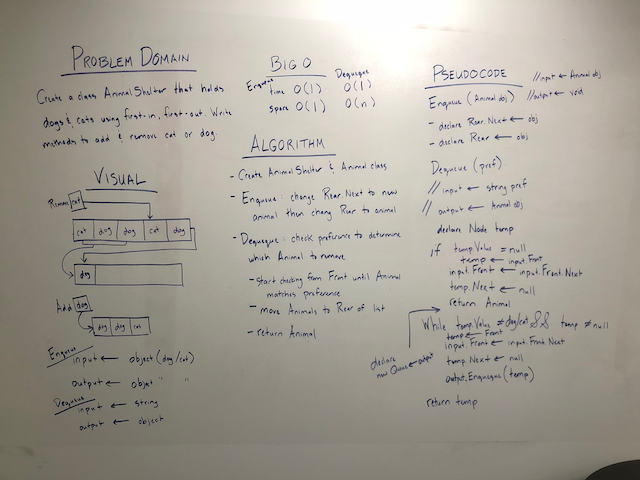

### First-In, First-Out Animal Shelter
## Challenge  

Create a class called AnimalShelter which holds only dogs and cats. The shelter operates using a first-in, first-out approach. Then implement the following methods:  
enqueue(animal): adds animal to the shelter. animal can be either a dog or a cat object.  
dequeue(pref): returns either a dog or a cat. If pref, a string, is ‘cat’ return the longest-waiting cat. If pref is ‘dog’, return the longest-waiting dog. For anything else, return either a cat or a dog.  
If a cat or dog isn’t preferred, return whichever animal has been waiting in the shelter the longest.  

## Approach & Efficiency

Enqueue:  
* Time Big-O = O(1)  -  It does not matter how many items are in the list as it takes the same amount of time to perform this operation.  
* Space Big-O = O(1)  -  No additional memory is required to perform this operation.  
  
Dequeue:
* Time Big-O = O(1)  -  This operation removes then adds the item to the list therefore it does not matter how many items are in the list as it takes the same amount of time to perform this operation.  
* Space Big-O = O(1)  -  No additional memory is required to perform this operation. 

## Solution

