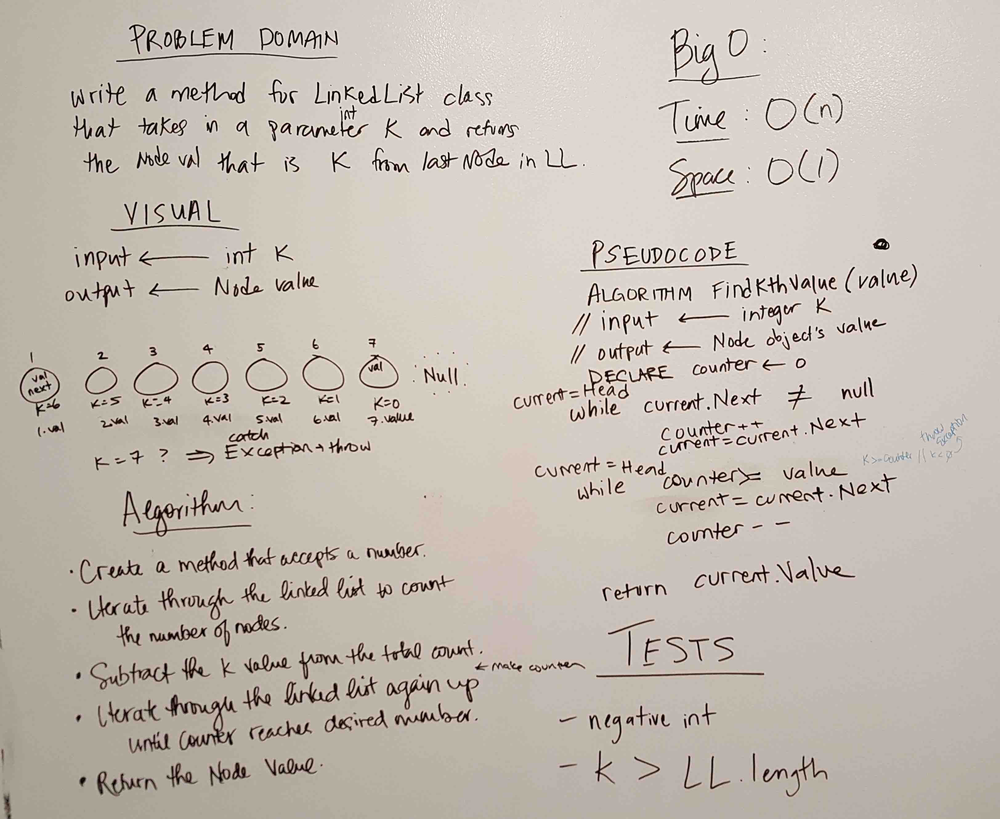

### Find the kth from the end of a linked list

## Challenge
Write a method for a linked list class that takes in a value k as a parameter and returns the node value of the kth node from the end of the linked list. 

## Solution

