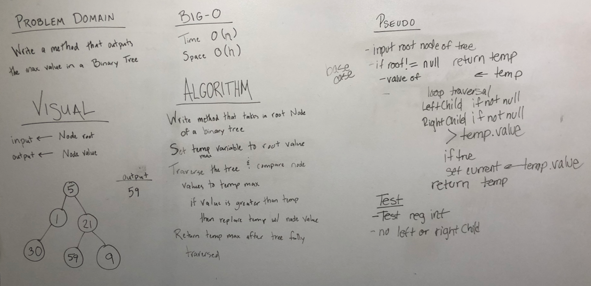

### Find the maximum value in a Binary Tree

## Challenge
Write a function which takes binary tree as its only input. Without utilizing any of the built-in methods available, return the maximum value stored in the tree. The values stored in the Binary Tree will all be numeric. 

## Solution

