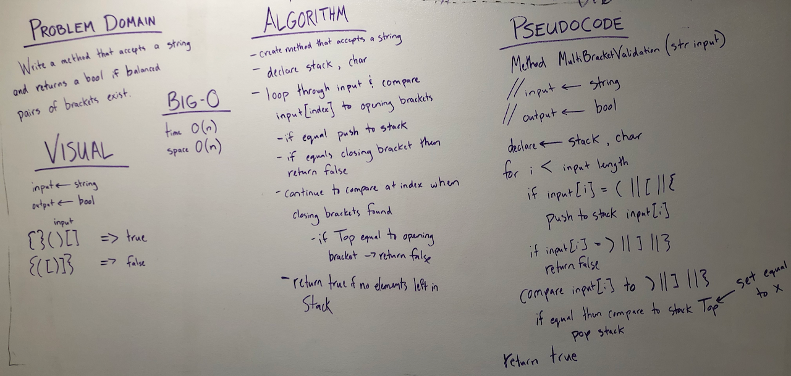

### Multi-bracket Validation

Write a method called MultiBracketValidation that takes in a string as its only argument, and should return a boolean representing whether or not the brackets in the string are balanced. There are 3 types of brackets: () [] {}

## Approach & Efficiency
1.	Time Big-O = O(n)	This method will need to go through all the characters in the string only once.
2.	Space Big-O = O(n)	The string input must be converted into an array of characters and a Stack must utilized. 

## Solution
