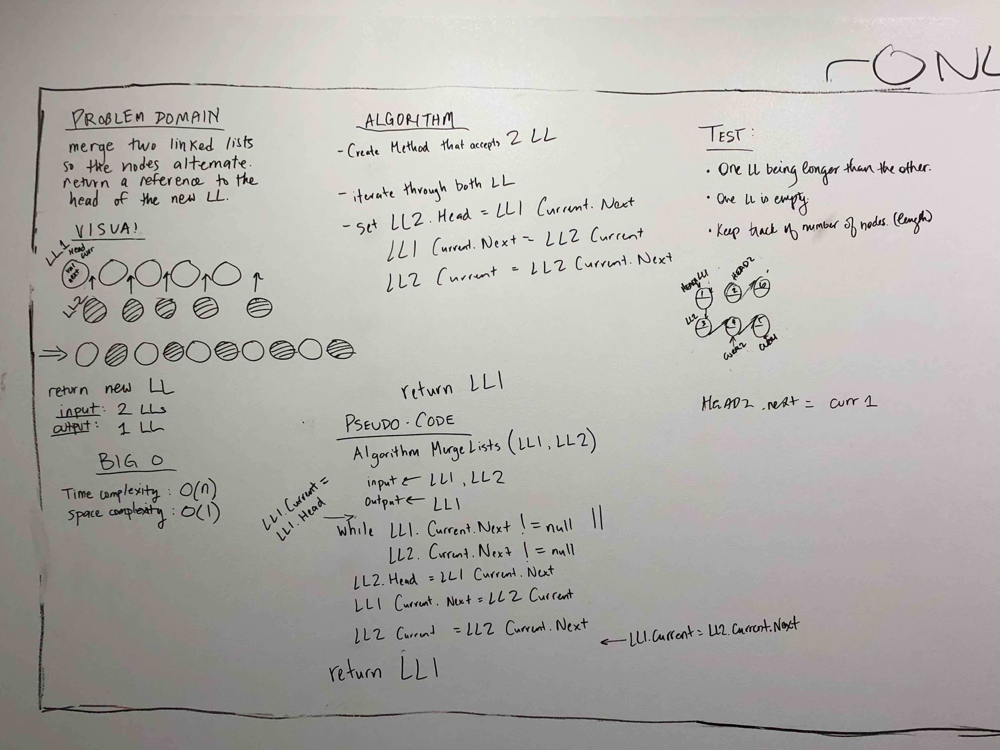

### Queue with Two Stacks

Create a Queue class that instantiates two Stacks in its constructor and implements the following methods:  
	-enqueue(value) which inserts value into the Queue using a first-in, first-out approach.  
	-dequeue() which extracts a value from the Queue using a first-in, first-out approach.

