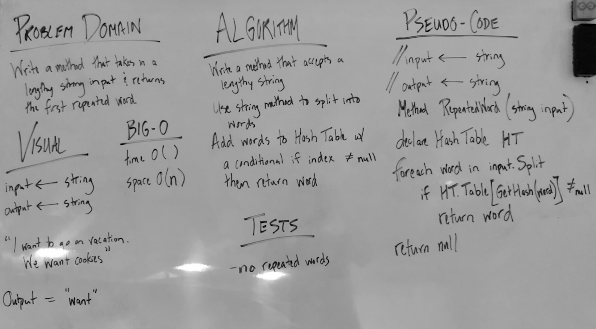

# First Repeated Word

## Challenge
Write a function that accepts a lengthy string parameter and returns the first repeated word. 

## Approach & Efficiency
* Time O(n)
	- the worst case, the entire string input will be need to be traversed to find any matching words  

* Space O(n)
	- a hash table is used to find the first repeated word  

## Solution
