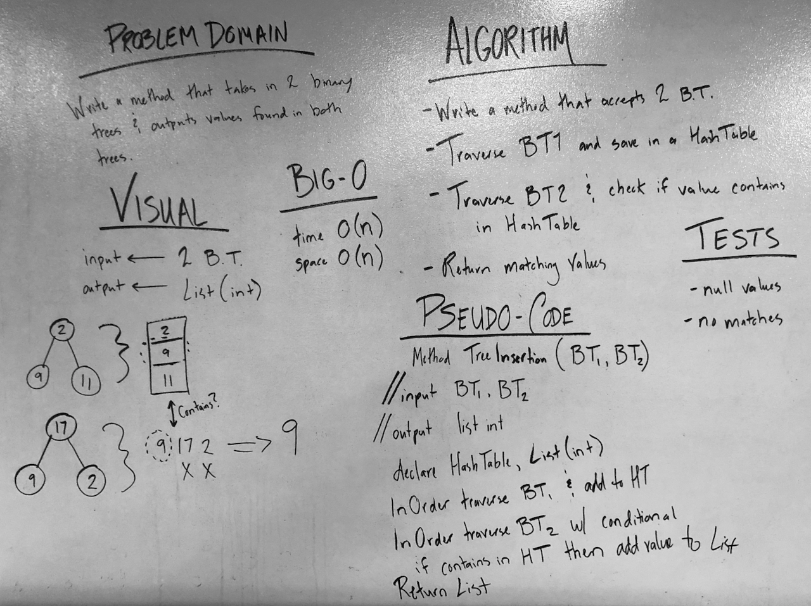

# Intersection of Binary Trees

## Challenge
Write a function called tree_intersection that takes two binary tree parameters. Without utilizing any of the built-in library methods available to your language, return a set of values found in both trees.  

## Approach & Efficiency
* Time O(n)
	- both binary trees must be traversed fully in order to find any matching values  

* Space O(n)
	- the method requires instantiating a Hash Table and Lists to return a List of matching values  

## Solution
