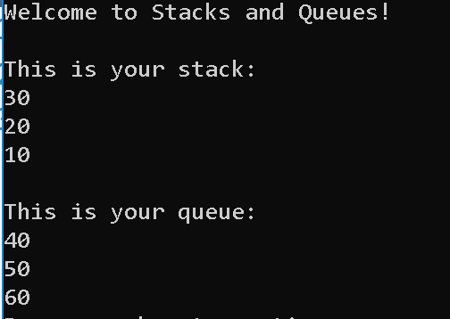

### Stack and Queue

Stacks are a data structure that is made up of nodes. Each node references the next node in the stack. 
	First in, last out - the first node in the stack will be the last node out
	Last in, first out - the last node in the stack will be the first node out

Queues are a data structure made up of nodes. Each node references the previous node. 
	First in, first out - the first node in will be the first node out
	Last in, last out - the last node in willbe the last node out

Uses: stacks and queues are used when you want to ensure data is not added in the middle of your structure
stacks - use when you want to get data out in reverser order, or the most recently added data
queues - use when you want to get data out in the order you inserted it

